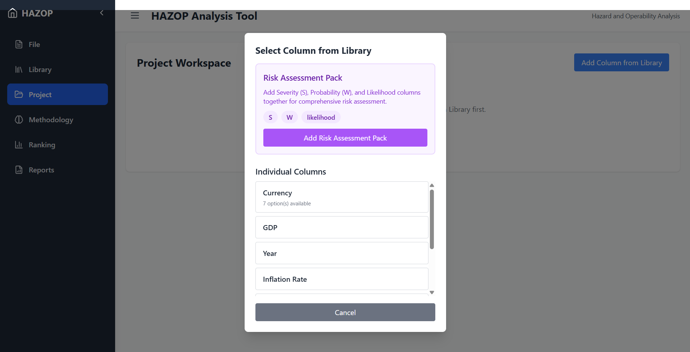
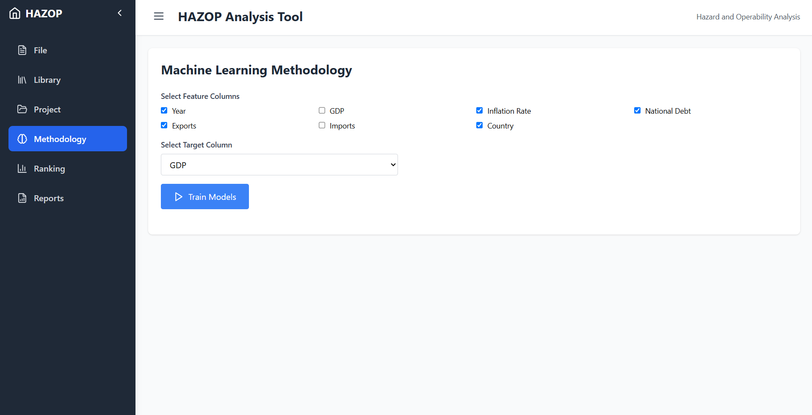
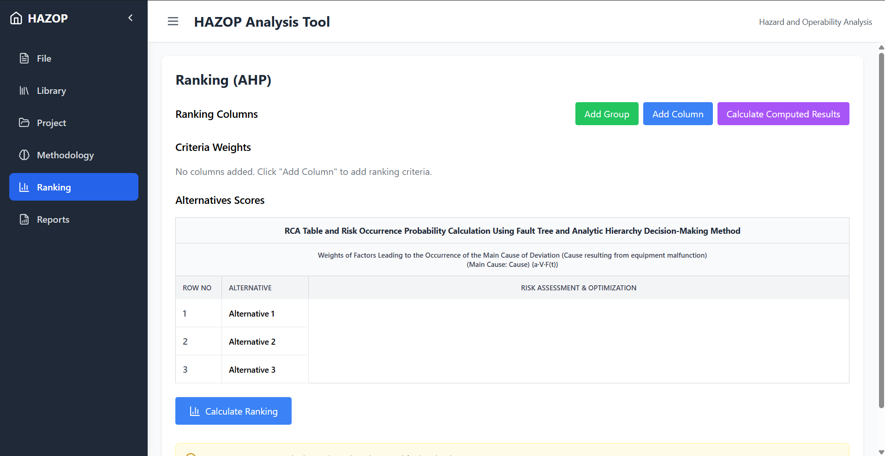
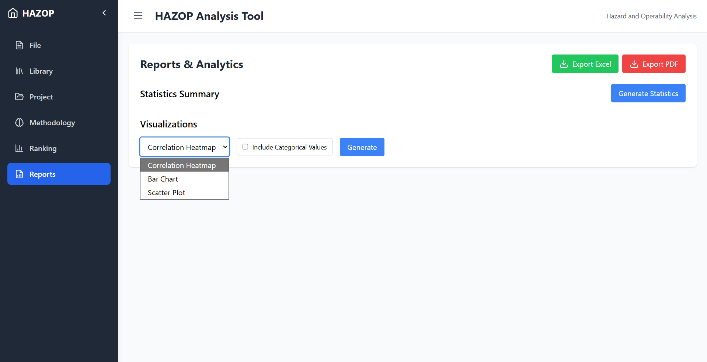

# HAZOP Analysis Tool

A full-stack web application for **Hazard and Operability (HAZOP)** analysis — combining a dynamic project workspace, machine learning risk prediction, AHP-based ranking, and automated report generation.



---

## Features

| Module | Description |
|---|---|
| **File management** | Open/save projects as `.xlsx`, `.csv`, or `.json` |
| **Library builder** | Define custom headers and dropdown option sets |
| **Project workspace** | Dynamic data table with built-in S/W risk matrix and auto-calculated likelihood |
| **ML methodology** | Train and compare 9 models (Random Forest, XGBoost, CatBoost, SVM, KNN, …) for both regression and classification |
| **AHP ranking** | RCA fault-tree table with group presets, criteria weighting, and Final Risk Score |
| **Reports** | Statistical summaries, distribution fitting, correlation heatmaps, export to PDF and Excel |

---

## Screenshots

<table>
  <tr>
    <td><br/><sub>Project workspace</sub></td>
    <td><br/><sub>ML methodology</sub></td>
  </tr>
  <tr>
    <td><br/><sub>AHP ranking table</sub></td>
    <td><br/><sub>Reports & analytics</sub></td>
  </tr>
</table>

---

## Tech stack

**Backend** — Python 3.8+, Flask, Flask-CORS, pandas, numpy, scikit-learn, XGBoost, CatBoost, openpyxl, reportlab, matplotlib, seaborn

**Frontend** — React 18, Vite, TailwindCSS, Recharts, React Router, Axios, Lucide React

---

## Quick start

### Prerequisites

- Python 3.8+
- Node.js 16+

### 1. Install backend dependencies

```bash
pip install -r requirements.txt
```

### 2. Install frontend dependencies

```bash
cd frontend
npm install
```

### 3. Run the app

Open **two terminals**:

```bash
# Terminal 1 — backend (http://localhost:5000)
cd backend
python app.py

# Terminal 2 — frontend (http://localhost:3000)
cd frontend
npm run dev
```

Then open [http://localhost:3000](http://localhost:3000) in your browser.

> **Windows shortcut:** double-click `run_backend.bat` and `run_frontend.bat`.

---

## Typical workflow

```
Library → Project → ML Methodology → Ranking → Reports
```

1. **Library** — define headers (e.g. "Deviation", "Cause") and their dropdown options.
2. **Project** — create a project, add columns from the library, fill rows. S/W risk matrix calculates likelihood automatically.
3. **Methodology** — select feature and target columns, train ML models, compare metrics, make predictions.
4. **Ranking** — add criteria groups (Design, Procurement, Operation…), enter scores and weights, calculate AHP ranking and Final Risk Score.
5. **Reports** — generate statistics, visualizations, and export as PDF or Excel.

---

## Project structure

```
hazop-app/
├── backend/
│   ├── app.py                  # Flask entry point
│   ├── routes/                 # API route handlers
│   │   ├── file_routes.py
│   │   ├── library_routes.py
│   │   ├── project_routes.py
│   │   ├── methodology_routes.py
│   │   ├── ranking_routes.py
│   │   └── report_routes.py
│   └── utils/
│       ├── file_manager.py
│       ├── ml_models.py
│       ├── ahp.py
│       └── report_generator.py
├── frontend/
│   └── src/
│       ├── pages/              # FilePage, LibraryPage, ProjectPage, …
│       ├── components/         # DataTable, Navbar, Sidebar
│       └── utils/              # api.js, riskMatrix.js
├── data/                       # Auto-created; stores project.xlsx, library.json
├── requirements.txt
└── README.md
```

---

## API overview

| Endpoint | Method | Description |
|---|---|---|
| `/api/file/open` | POST | Open a project file |
| `/api/file/save` | POST | Save project as Excel |
| `/api/library/get` | GET | Get library config |
| `/api/project/update` | POST | Update project rows |
| `/api/methodology/train` | POST | Train ML models |
| `/api/ranking/update` | POST | Save ranking data |
| `/api/ranking/ahp` | POST | Calculate AHP ranking |
| `/api/report/statistics` | POST | Generate statistics |
| `/api/report/export-pdf` | POST | Export report as PDF |

Full API documentation is available in [`README_API.md`](README_API.md).

---

## Troubleshooting

**Backend won't start** → check that port 5000 is free; verify all Python packages are installed with `pip list`.

**Frontend won't start** → check that port 3000 is free; try `npm cache clean --force && npm install`.

**CORS errors** → make sure the backend is running on port 5000 before loading the frontend.

**Data not saving** → verify the `data/` directory was created automatically at the project root.

---

## License

MIT — see [LICENSE](LICENSE) for details.

---

## Contributing

Pull requests are welcome. For major changes, please open an issue first to discuss what you'd like to change.
